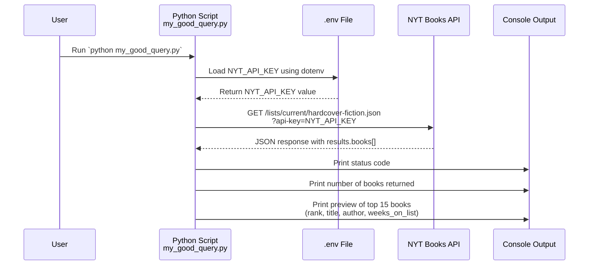

## Overview

This README documents the Python script `my_good_query.py`, which queries the **New York Times Books API** to retrieve the current **Hardcover Fiction** bestseller list.

The script is designed to:
- **Call a real API endpoint** that returns a substantial dataset (15+ book records).
- **Load a secure API key** from a local `.env` file.
- **Print a concise preview** of key book information for use in a future reporting or dashboard application.

## API Endpoint and Parameters

- **API name**: New York Times Books API  
- **HTTP method**: `GET`  
- **Base URL**: `https://api.nytimes.com/svc/books/v3`  
- **Endpoint**: `/lists/current/{list_name_encoded}.json`

In this script:
- **`list_name_encoded`**: `"hardcover-fiction"`  
- **Full endpoint URL used**:  
  `https://api.nytimes.com/svc/books/v3/lists/current/hardcover-fiction.json`

### Query Parameters

- **`api-key`** (required)
  - **Source**: Loaded from `.env` as `NYT_API_KEY`
  - **Type**: string
  - **Location**: query parameter

Example request (conceptual):

```text
GET /svc/books/v3/lists/current/hardcover-fiction.json?api-key=YOUR_API_KEY
Host: api.nytimes.com
```

If the API key is missing or still a placeholder (e.g., starts with `"your_"`), the script prints an error message and exits with a non-zero status code.

## Data Structure (Response Shape)

The script expects the JSON response to contain:

- **Top-level fields** (simplified):
  - `status`: API status (e.g., `"OK"`)
  - `results`: object containing details about the list

- **`results` object** (key fields used):
  - `books`: **list of book objects** (this is the substantial dataset used for reporting)

- **Each `book` object** (subset of important fields):
  - `rank`: Bestseller rank (integer)
  - `title`: Book title (string)
  - `author`: Author name (string)
  - `weeks_on_list`: How many weeks the book has been on the list (integer)
  - `publisher`: Publisher (string)
  - (Additional fields are available but not printed in this script.)

In code, the script accesses:
- `data = resp.json()`
- `books = data.get("results", {}).get("books", [])`

It then:
- Prints `Number of books returned: {len(books)}`
- Iterates over the first 15 books and prints a formatted preview.

## Mermaid Diagram – Query Flow

The following Mermaid diagram shows the end-to-end flow from your local environment to the NYT Books API and back to the console output.



This serves as **visual evidence of the process**, showing how your script, environment, and the remote API interact.

## Usage Instructions

Follow these steps to run `my_good_query.py` successfully.

### 1. Install Dependencies

Ensure you have Python and the required packages installed (from your project environment):

- `requests`
- `python-dotenv`

Example installation (if needed):

```bash
pip install requests python-dotenv
```

### 2. Create and Configure `.env`

In the project root (or the same directory where you run the script), create a file named `.env` with:

```text
NYT_API_KEY=YOUR_REAL_NYT_API_KEY_HERE
```

- Replace `YOUR_REAL_NYT_API_KEY_HERE` with a valid New York Times API key.
- Make sure it does **not** start with `"your_"`, or the script will treat it as a placeholder and exit with an error.

### 3. Run the Script

From the `01_query_api` directory (or project root, depending on how you run it), execute:

```bash
python my_good_query.py
```

### 4. Interpret the Output

You should see output similar to:

```text
Response Status Code: 200
Number of books returned: 15

Preview (top 15):
- Rank 1: 'BOOK TITLE 1' by AUTHOR 1 (Weeks on list: 10)
- Rank 2: 'BOOK TITLE 2' by AUTHOR 2 (Weeks on list: 5)
...
```

- **Status code 200** indicates success.
- The **number of books returned** confirms you are getting a substantial dataset suitable for reporting.
- The **preview** gives a human-readable summary (rank, title, author, weeks on list) for the first 15 books.

You can later adapt this script to:
- Save the `books` data to CSV or a database.
- Feed it into an AI reporter or visualization tool.
- Filter or transform the data for specific reporting needs.

