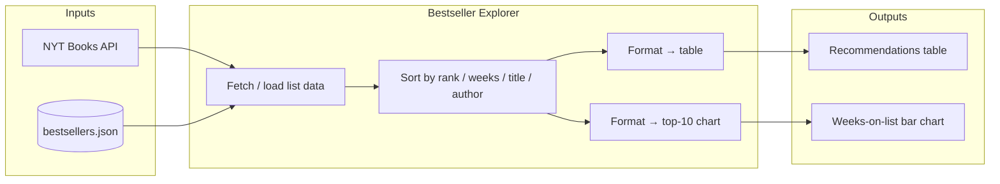

# Tool Definition & Process: Bestseller Explorer

**One-sentence definition:**  
**Bestseller Explorer** — A Shiny app that lets users browse NYT bestseller lists, sort and filter recommendations, and view a table plus a top-10 “weeks on list” dashboard.

---

## Process Diagram

**In words:** Data comes from the NYT Books API or a pre-fetched JSON file → the app fetches/loads the selected list, applies the user’s sort choice → formats the result into a recommendations table and a top-10 bar chart → user sees table + chart.

---

## Stakeholders & Needs

| Stakeholder | Need |
|-------------|------|
| **Reader / book shopper** | Quick, scannable recommendations by category and a sense of which titles have “staying power” (weeks on list). |
| **Instructor / reviewer** | A single deployable demo showing API integration, Shiny UI, and simple visualization for grading or demos. |

---

## System Goals (Core Functions)

1. **FORMAT** — Turn API/JSON into a structured table (rank, title, author, weeks on list, publisher) and a horizontal bar chart.
2. **INTERPRET** — Expose “weeks on list” as a signal of longevity; support sort/filter so users can compare and explore.
3. **SUMMARIZE** — Provide a top-10 view that summarizes each list to the most relevant titles by weeks on list.

---

## Mapping: Stakeholder Needs → System Goals

| Stakeholder need | System goal(s) that address it |
|------------------|--------------------------------|
| Reader needs scannable recommendations by category | **FORMAT** (clear table and chart); **INTERPRET** (weeks on list, sort by rank/weeks/title/author). |
| Reader wants to see “staying power” of books | **INTERPRET** (weeks on list in table and chart); **SUMMARIZE** (top-10 by weeks). |
| Instructor needs a deployable demo | **FORMAT** (readable UI and data presentation); **INTERPRET** (clear data flow from API/JSON to table and chart). |

---

*Design is tentative and can be revised later.*
